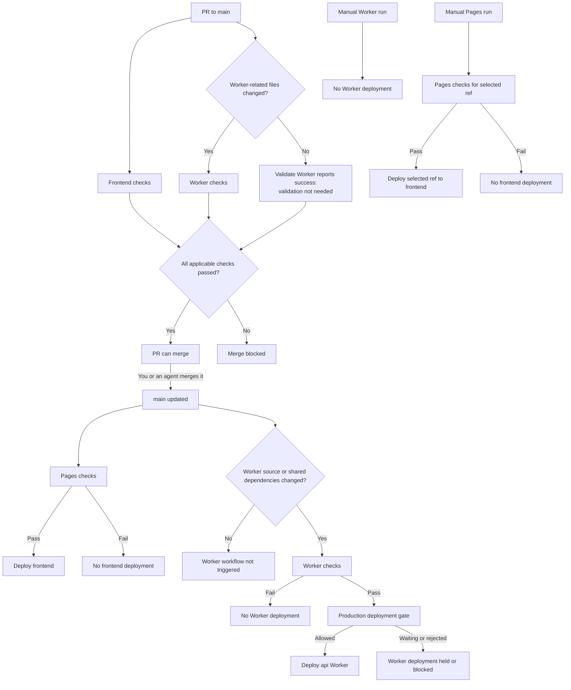

# GitHub Actions workflows

The Pages frontend and Cloudflare Worker have independent workflows.
Checks must pass before the corresponding deployment can proceed.

## Checks and deployment gates

- [Pages](deploy.yml): lint, unit tests, and a static production build.
- [Worker](deploy-worker.yml): lint, type-checking, unit tests, and a Wrangler
  dry-run build. The required `Validate Worker` job reports on every PR, but
  runs these checks only for relevant changes. Otherwise, it reports success
  with "Worker validation not needed."
- Relevant PR changes include `workers/weather/**`, the shared
  `app/utils/provider-validation.ts`, `app/utils/weather.ts`, and
  `app/types/weather.ts`, repository dependency/pnpm configuration, ESLint
  configuration, and the Worker workflow itself.
- Failed deployment checks stop that deployment. Neither workflow waits for
  the other workflow after `main` is updated.
- Worker pushes trigger its workflow only when `workers/weather/**` or one of
  those three shared source files changes. Shared source changes also need
  deployment because they are bundled into the Worker. Push and manual runs
  always perform full Worker validation.
- The Worker production gate waits for approval **only if required reviewers
  are configured on the GitHub `production` Environment**. Without that
  setting, it proceeds automatically after checks pass. Deployment also needs
  the Environment's Cloudflare secrets; see the
  [Worker setup and recovery runbook](../../workers/weather/README.md#automated-production-deployment).
- Manual Pages runs can deploy the selected ref. Manual Worker runs never
  deploy.

## Branch protection

`main` requires `lint`, `test`, `Static production build`, and `Validate Worker`
to pass, with branches up to date before merging. It does not require a PR,
reviewer approval, or resolved review conversations. Direct pushes are still
subject to the required checks for the pushed commit. These settings are
managed in GitHub, not by the workflow YAML.
